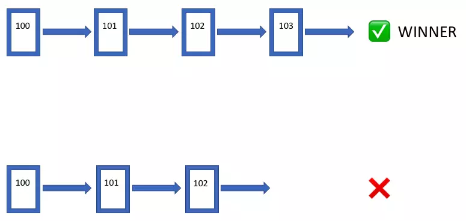
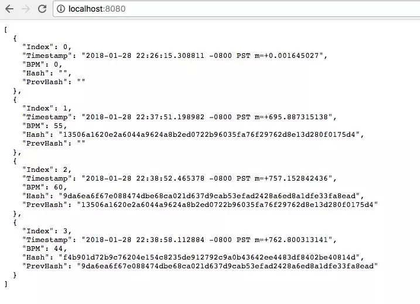

# GO代码实现的最小区块链Demo

转载文章
https://mp.weixin.qq.com/s?__biz=MzAwMDU1MTE1OQ==&mid=2653549361&idx=1&sn=019f54713891cf33ef3bef3b24773a96&chksm=813a62a9b64debbfdd24a8507bb974048a4456e5b0a2d5f685fb3bdf40366a25764c5df8afec&scene=21#wechat_redirect


“用不到200行 Go 代码就能实现一个自己的区块链！” 听起来有意思吗？有什么能比开发一个自己的区块链更好的学习实践方法呢？那我们就一起来实践下！

因为我们是一家从事医疗健康领域的科技公司，所以我们采用人类平静时的心跳数据（BPM心率）作为这篇文章中的示例数据。让我们先来统计一下你一分钟内的心跳数，然后记下来，这个数字可能会在接下来的内容中用到。

通过本文，你将可以做到：

- 创建自己的区块链
- 理解 hash 函数是如何保持区块链的完整性
- 如何创造并添加新的块
- 多个节点如何竞争生成块
- 通过浏览器来查看整个链
- 所有其他关于区块链的基础知识

但是，对于比如工作量证明算法（PoW）以及权益证明算法（PoS）这类的共识算法文章中将不会涉及。同时为了让你更清楚得查看区块链以及块的添加，我们将网络交互的过程简化了，关于 P2P 网络比如“全网广播”这个过程等内容将在下一篇文章中补上。

## 让我们开始吧！

## 设置

我们假设你已经具备一点 Go 语言的开发经验。在安装和配置 Go 开发环境后之后，我们还要获取以下一些依赖：
```bash
go get github.com/davecgh/go-spew/spew
```
spew 可以帮助我们在 console 中直接查看 struct 和 slice 这两种数据结构。

```bash
go get github.com/gorilla/mux
```
Gorilla 的 mux 包非常流行， 我们用它来写 web handler。

```bash
go get github.com/joho/godotenv
```
godotenv 可以帮助我们读取项目根目录中的 .env 配置文件，这样我们就不用将 http port 之类的配置硬编码进代码中了。比如像这样：
```
ADDR=8080
```

接下来，我们创建一个 main.go 文件。之后我们的大部分工作都围绕这个文件，让我开始编码吧！

### 导入依赖

我们将所有的依赖包以声明的方式导入进去：
```go
package main

import (
    "crypto/sha256"
    "encoding/hex"
    "encoding/json"
    "io"
    "log"
    "net/http"
    "os"
    "time"

    "github.com/davecgh/go-spew/spew"
    "github.com/gorilla/mux"
    "github.com/joho/godotenv"
)
```

### 数据模型

接着我们来定义一个结构体，它代表组成区块链的每一个块的数据模型：
```go
type Block struct {
    Index     int
    Timestamp string
    BPM       int
    Hash      string
    PrevHash  string
}
```
- Index 是这个块在整个链中的位置
- Timestamp 显而易见就是块生成时的时间戳
- Hash 是这个块通过 SHA256 算法生成的散列值
- PrevHash 代表前一个块的 SHA256 散列值
- BPM 每分钟心跳数，也就是心率。还记得文章开头说到的吗？

接着，我们再定义一个结构表示整个链，最简单的表示形式就是一个 Block 的 slice：
```go
var Blockchain []Block
```

我们使用散列算法（SHA256）来确定和维护链中块和块正确的顺序，确保每一个块的 PrevHash 值等于前一个块中的 Hash 值，这样就以正确的块顺序构建出链：


### 散列和生成块

我们为什么需要散列？主要是两个原因：
- 在节省空间的前提下去唯一标识数据。散列是用整个块的数据计算得出，在我们的例子中，将整个块的数据通过 SHA256 计算成一个定长不可伪造的字符串。
- 维持链的完整性。通过存储前一个块的散列值，我们就能够确保每个块在链中的正确顺序。任何对数据的篡改都将改变散列值，同时也就破坏了链。以我们从事的医疗健康领域为例，比如有一个恶意的第三方为了调整“人寿险”的价格，而修改了一个或若干个块中的代表不健康的 BPM 值，那么整个链都变得不可信了。

我们接着写一个函数，用来计算给定的数据的 SHA256 散列值：
```go
func calculateHash(block Block) string {
    record := string(block.Index) + block.Timestamp + string(block.BPM) + block.PrevHash
    h := sha256.New()
    h.Write([]byte(record))
    hashed := h.Sum(nil)
    return hex.EncodeToString(hashed)
}
```

这个 calculateHash 函数接受一个块，通过块中的 Index，Timestamp，BPM，以及 PrevHash 值来计算出 SHA256 散列值。接下来我们就能便携一个生成块的函数：
```go
func generateBlock(oldBlock Block, BPM int) (Block, error) {
    var newBlock Block

    t := time.Now()
    newBlock.Index = oldBlock.Index + 1
    newBlock.Timestamp = t.String()
    newBlock.BPM = BPM
    newBlock.PrevHash = oldBlock.Hash
    newBlock.Hash = calculateHash(newBlock)

    return newBlock, nil
}
```

其中，Index 是从给定的前一块的 Index 递增得出，时间戳是直接通过 time.Now() 函数来获得的，Hash 值通过前面的 calculateHash 函数计算得出，PrevHash 则是给定的前一个块的 Hash 值。

### 校验块

搞定了块的生成，接下来我们需要有函数帮我们判断一个块是否有被篡改。检查 Index 来看这个块是否正确得递增，检查 PrevHash 与前一个块的 Hash 是否一致，再来通过 calculateHash 检查当前块的 Hash 值是否正确。通过这几步我们就能写出一个校验函数：
```go
func isBlockValid(newBlock, oldBlock Block) bool {
    if oldBlock.Index+1 != newBlock.Index {
        return false
    }
    if oldBlock.Hash != newBlock.PrevHash {
        return false
    }
    if calculateHash(newBlock) != newBlock.Hash {
        return false
    }
    return true
}
```

除了校验块以外，我们还会遇到一个问题：两个节点都生成块并添加到各自的链上，那我们应该以谁为准？这里的细节我们留到下一篇文章，这里先让我们记住一个原则：始终选择最长的链。




通常来说，更长的链表示它的数据（状态）是更新的，所以我们需要一个函数
能帮我们将本地的过期的链切换成最新的链：
```go
func replaceChain(newBlocks []Block) {
    if len(newBlocks) > len(Blockchain) {
        Blockchain = newBlocks
    }
}
```


到这一步，我们基本就把所有重要的函数完成了。接下来，我们需要一个方便直观的方式来查看我们的链，包括数据及状态。通过浏览器查看 web 页面可能是最合适的方式！

### Web 服务

我猜你一定对传统的 web 服务及开发非常熟悉，所以这部分你肯定一看就会。
借助 Gorilla/mux 包，我们先写一个函数来初始化我们的 web 服务：
```go
func run() error {
    mux := makeMuxRouter()
    httpAddr := os.Getenv("ADDR")
    log.Println("Listening on ", os.Getenv("ADDR"))
    s := &http.Server{
        Addr:           ":" + httpAddr,
        Handler:        mux,
        ReadTimeout:    10 * time.Second,
        WriteTimeout:   10 * time.Second,
        MaxHeaderBytes: 1 << 20,
    }

    if err := s.ListenAndServe(); err != nil {
        return err
    }

    return nil
}
```

其中的端口号是通过前面提到的 .env 来获得，再添加一些基本的配置参数，这个 web 服务就已经可以 listen and serve 了！
接下来我们再来定义不同 endpoint 以及对应的 handler。例如，对“/”的 GET 请求我们可以查看整个链，“/”的 POST 请求可以创建块。
``` go
func makeMuxRouter() http.Handler {
    muxRouter := mux.NewRouter()
    muxRouter.HandleFunc("/", handleGetBlockchain).Methods("GET")
    muxRouter.HandleFunc("/", handleWriteBlock).Methods("POST")
    return muxRouter
}
```

GET 请求的 handler：
```go
func handleGetBlockchain(w http.ResponseWriter, r *http.Request) {
    bytes, err := json.MarshalIndent(Blockchain, "", "  ")
    if err != nil {
        http.Error(w, err.Error(), http.StatusInternalServerError)
        return
    }
    io.WriteString(w, string(bytes))
}
```

为了简化，我们直接以 JSON 格式返回整个链，你可以在浏览器中访问 localhost:8080 或者 127.0.0.1:8080 来查看（这里的8080就是你在 .env 中定义的端口号 ADDR）。

POST 请求的 handler 稍微有些复杂，我们先来定义一下 POST 请求的 payload：
``` go
type Message struct {
    BPM int
}
```

再看看 handler 的实现：
``` go
func handleWriteBlock(w http.ResponseWriter, r *http.Request) {
    var m Message

    decoder := json.NewDecoder(r.Body)
    if err := decoder.Decode(&m); err != nil {
        respondWithJSON(w, r, http.StatusBadRequest, r.Body)
        return
    }
    defer r.Body.Close()

    newBlock, err := generateBlock(Blockchain[len(Blockchain)-1], m.BPM)
    if err != nil {
        respondWithJSON(w, r, http.StatusInternalServerError, m)
        return
    }
    if isBlockValid(newBlock, Blockchain[len(Blockchain)-1]) {
        newBlockchain := append(Blockchain, newBlock)
        replaceChain(newBlockchain)
        spew.Dump(Blockchain)
    }

    respondWithJSON(w, r, http.StatusCreated, newBlock)
}
```

我们的 POST 请求体中可以使用上面定义的 payload，比如：
```javascript
{"BPM":75}
```

还记得前面我们写的 generateBlock 这个函数吗？它接受一个“前一个块”参数，和一个 BPM 值。POST handler 接受请求后就能获得请求体中的 BPM 值，接着借助生成块的函数以及校验块的函数就能生成一个新的块了！

除此之外，你也可以：
- 使用spew.Dump 这个函数可以以非常美观和方便阅读的方式将 struct、slice 等数据打印在控制台里，方便我们调试。
- 测试 POST 请求时，可以使用 POSTMAN 这个 chrome 插件，相比 curl它更直观和方便。

POST 请求处理完之后，无论创建块成功与否，我们需要返回客户端一个响应：
```go
func respondWithJSON(w http.ResponseWriter, r *http.Request, code int, payload interface{}) {
    response, err := json.MarshalIndent(payload, "", "  ")
    if err != nil {
        w.WriteHeader(http.StatusInternalServerError)
        w.Write([]byte("HTTP 500: Internal Server Error"))
        return
    }
    w.WriteHeader(code)
    w.Write(response)
}
```

### 快要大功告成了

接下来，我们把这些关于区块链的函数，web 服务的函数“组装”起来：
```go
func main() {
    err := godotenv.Load()
    if err != nil {
        log.Fatal(err)
    }

    go func() {
        t := time.Now()
        genesisBlock := Block{0, t.String(), 0, "", ""}
        spew.Dump(genesisBlock)
        Blockchain = append(Blockchain, genesisBlock)
    }()
    log.Fatal(run())
}
```

这里的 genesisBlock （创世块）是 main 函数中最重要的部分，通过它来初始化区块链，毕竟第一个块的 PrevHash 是空的。


## 完成了

你们可以从这里获得完整的代码：Github repo[1]
让我们来启动它：
go run main.go

在终端中，我们可以看到 web 服务器启动的日志信息，并且打印出了创世块的信息：


接着我们打开浏览器，访问 localhost:8080 这个地址，我们可以看到页面中展示了当前整个区块链的信息（当然，目前只有一个创世块）：


接着，我们再通过 POSTMAN 来发送一些 POST 请求：


刷新刚才的页面，现在的链中多了一些块，正是我们刚才生成的，同时你们可以看到，块的顺序和散列值都正确。



### 下一步

刚刚我们完成了一个自己的区块链，虽然很简单（陋），但它具备块生成、散列计算、块校验等基本能力。接下来你就可以继续深入的学习区块链的其他重要知识，比如工作量证明、权益证明这样的共识算法，或者是智能合约、Dapp、侧链等等。

目前这个实现中不包括任何 P2P 网络的内容，我们会在下一篇文章中补充这部分内容，当然，我们鼓励你在这个基础上自己实践一遍！