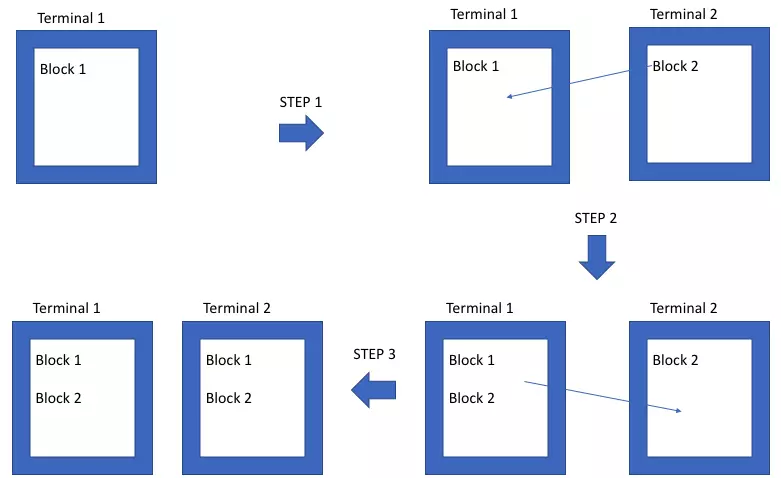
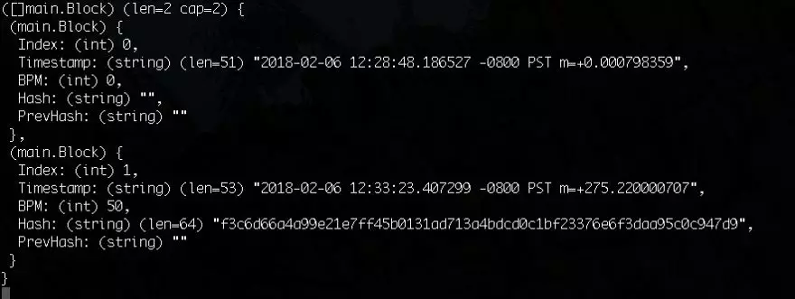

# GO代码实现的区块生成与网络

参考文章
https://mp.weixin.qq.com/s?__biz=MzAwMDU1MTE1OQ==&mid=2653549384&idx=1&sn=fce9e6fa059c044a6abfcf2cc3241ba5&chksm=813a62d0b64debc657e09718d6c851ee1cc7c37d3cb5b0a4213732a331dcd4bd5aae38a5fdf4&scene=21#wechat_redirect

这篇文章在[之前](main1.md)的基础上，解决多个节点网络内，如何生成块、如何通信、如何广播消息等。

## 流程



- 第一个节点创建“创始区块”，同时启动 TCP server并监听一个端口，等待其他节点连接。

### Step 1
- 启动其他节点，并与第一个节点建立TCP连接（这里我们通过不同的终端来模拟其他节点）
- 创建新的块

### Step 2
- 第一个节点验证新生成块
- 验证之后广播（链的新状态）给其他节点

### Step 3
- 所有的节点都同步了最新的链的状态

之后你可以重复上面的步骤，使得每个节点都创建TCP server并监听（不同的）端口以便其他节点来连接。通过这样的流程你将建立一个简化的模拟的（本地的）P2P网络，当然你也可以将节点的代码编译后，将二进制程序部署到云端。

## 开始coding吧

设置与导入依赖

### 参考之前第一篇文章，我们使用相同的计算 hash 的函数、验证块数据的函数等。

[GO代码实现的最简易的区块链](main1.md)

### 网络通信

接着我们来建立各个节点间的网络，用来传递块、同步链状态等。

我们先来声明一个全局变量 bcServer ，以 channel（译者注：channel 类似其他语言中的 Queue,代码中声明的是一个 Block 数组的 channel）的形式来接受块。

``` go
// bcServer handles incoming concurrent Blocks
var bcServer chan []Block
```

注：Channel 是 Go 语言中很重要的特性之一，它使得我们以流的方式读写数据，特别是用于并发编程。通过这里[2]可以更深入地学习 Channel。

接下来我们声明 main 函数，从 .env 加载配置，也就是端口号，然后实例化 bcServer

```go
func main() {
    err := godotenv.Load()
    if err != nil {
        log.Fatal(err)
    }

    bcServer = make(chan []Block)

    // create genesis block
    t := time.Now()
    genesisBlock := Block{0, t.String(), 0, "", ""}
    spew.Dump(genesisBlock)
    Blockchain = append(Blockchain, genesisBlock)
}
```

接着创建 TCP server 并监听端口：

```go
    // start TCP and serve TCP server
    server, err := net.Listen("tcp", ":"+os.Getenv("ADDR"))
    if err != nil {
        log.Fatal(err)
    }
    defer server.Close()
```

需要注意这里的 defer server.Close()，它用来之后关闭链接，可以从这里了解更多 defer 的用法。

```go
for {
        conn, err := server.Accept()
        if err != nil {
            log.Fatal(err)
        }
        go handleConn(conn)
    }
```

通过这个无限循环，我们可以接受其他节点的 TCP 链接，同时通过 go handleConn(conn) 启动一个新的 go routine（译者注：Rob Pike 不认为go routine 是协程，因此没有译为协程）来处理请求。

接下来是“处理请求”这个重要函数，其他节点可以创建新的块并通过 TCP 连接发送出来。在这里我们依然像第一篇文章一样，以 BPM 来作为示例数据。

- 客户端通过 stdin 输入 BPM
- 以 BPM 的值来创建块，这里会用到前面的函数：generateBlock，isBlockValid，和 replaceChain
- 将新的链放在 channel 中，并广播到整个网络

```go
func handleConn(conn net.Conn) {
    io.WriteString(conn, "Enter a new BPM:")

    scanner := bufio.NewScanner(conn)

    // take in BPM from stdin and add it to blockchain after 
    // conducting necessary validation
    go func() {
        for scanner.Scan() {
            bpm, err := strconv.Atoi(scanner.Text())
            if err != nil {
                log.Printf("%v not a number: %v", scanner.Text(), err)
                continue
            }
            newBlock, err := generateBlock(
                                Blockchain[len(Blockchain)-1], bpm)
            if err != nil {
                log.Println(err)
                continue
            }
            if isBlockValid(newBlock, Blockchain[len(Blockchain)-1]) {
                newBlockchain := append(Blockchain, newBlock)
                replaceChain(newBlockchain)
            }

            bcServer <- Blockchain
            io.WriteString(conn, "\nEnter a new BPM:")
        }
    }()
    
    defer conn.Close()
}
```

我们创建一个 scanner，并通过 for scanner.Scan() 来持续接收连接中发来的数据。为了简化，我们把 BPM 数值转化成字符串。bcServer <- Blockchain 是表示我们将新的链写入 channel 中。

通过 TCP 链接将最新的链广播出去时，我们需要：

- 将数据序列化成 JSON 格式
- 通过 timer 来定时广播
- 在控制台中打印出来，方便我们查看链的最新状态

```go
    // simulate receiving broadcast
    go func() {
        for {
            time.Sleep(30 * time.Second)
            output, err := json.Marshal(Blockchain)
            if err != nil {
                log.Fatal(err)
            }
            io.WriteString(conn, string(output))
        }
    }()

    for _ = range bcServer {
        spew.Dump(Blockchain)
    }
```

整个 handleConn 函数差不多就完成了，通过这里[4]可以获得完整的代码。

有意思的地方

现在让我们来启动整个程序，
```bash
go run main.go
```


就像我们预期的，首先创建了“创世块”，接着启动了 TCP server 并监听9000端口。

接着我们打开一个新的终端，连接到那个端口。（我们用不同颜色来区分）
```
nc localhost 9000
```

接下来我们输入一个BPM值：



接着我们从第一个终端（节点）中能看到（依据输入的BPM）创建了新的块。


我们等待30秒后，可以从其他终端（节点）看到广播过来的最新的链。

## 下一步

到目前为止，我们为这个例子添加了简单的、本地模拟的网络能力。当然，肯定有读者觉得这不够有说服力。但本质上来说，这就是区块链的网络层。它能**接受外部数据并改变内在数据的状态，又能将内在数据的最新状态广播出去。**